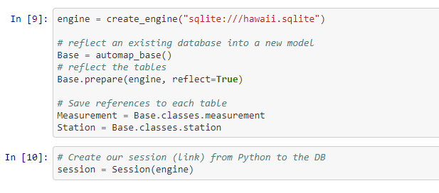
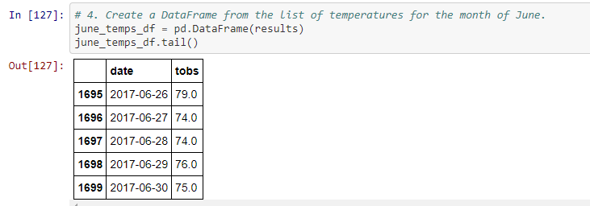
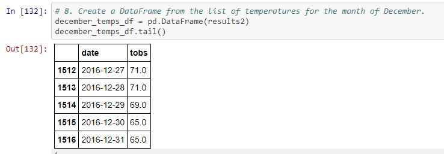
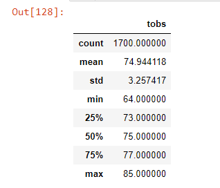
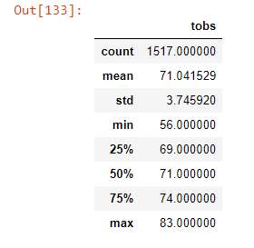

# Overview
This analysis uses Python and SQLAlchemy to query a SQLite file containing weather data for the island of Oahu. I analyzed the 2010-2017 weather data with the aim of understanding how best to build a surf shack business. This analysis contains two parts. First, I determined the temperatures we can expect on Oahu in June. Second, I ran the same analysis for the month of December. 

## Tools
Software: Python, Jupyter Notebook

Python packages: numpy, datetime, pandas, sqlalchemy

Data: [hawaii.sqlite](https://github.com/perryabdulkadir/surfs_up/blob/main/hawaii.sqlite)

## Analysis

The first step of the analysis was connecting to the SQLite database, which was accomplished by the code below: 

 

**June** 

To begin analysis for June, I queried the Measurement table to retrieve June temperatures for every year that data was available (2010-2018). 

```
# 1. Import the sqlalchemy extract function.
from sqlalchemy import extract
# 2. Write a query that filters the Measurement table to retrieve the temperatures for the month of June. 
june = [dt.date(year, 6, day) for day in range (1, 31) for year in range (2010, 2018)]
results = []
results = session.query(Measurement.date, Measurement.tobs).filter(extract('month', Measurement.date) == 6 )
results.all()
```
To allow for easier analysis, I converted the queried June temperatures into a list. 
```
results = session.query(Measurement.date, Measurement.tobs).filter(extract('month', Measurement.date) == 6 )
list(results.all())
```
Next, I made a data frame to hold the June temperatures and their respective dates. 

 

**December**

I simply refactored the code June code to work for the December analysis. I started with querying all December temperatures. 

```
december = [dt.date(year, 6, day) for day in range (1, 31) for year in range (2010, 2018)]
results2 = []
results2 = session.query(Measurement.date, Measurement.tobs).filter(extract('month', Measurement.date) == 12 )
results2.all()
```
I turned the result of that query into a list: 
```
results = session.query(Measurement.date, Measurement.tobs).filter(extract('month', Measurement.date) == 6 )
list(results2.all())
```
I then put the December temperatures and dates in a data frame. 

 

## Results

**June**

 

**December**

 

* There are not significant differences between June weather and December weather. 
This is unsurprising, given Hawaii's tropical climate. But this helps confirm our intuition that having our surf shack open year round will not face many problems from uncooperative weather. The mean June temperature is roughly 75 degrees, and the mean December temperature is a balmy 71. 

* The minimum temperature is lower in December. 
The minimum temperature in June was 64 degrees compared to the minimum temperature in December, which was 56 degrees. While 56 degrees is not exactly skiing weather, it may be cool enough to deter some people on the coldest days of the year. This may inform our decision to close the shop briefly during the part of the year when the coldest temperatures are likely to occur. We may also decide to close the shop at an earlier time in the day during the winter before colder nighttime temperatures drive customers away from the beach. 

* The weather is equally consistent in June and December. 
The standard deviation of temperatures is 3.26 in June and 3.75 in December. If certain times of the year had temperatures with higher standard deviations (i.e., more variable weather) that could influence our decision to shut down at times of unpredictable weather. However, the weather has a similar variability throughout the year. 50% of temperatures in June are between 73 and 77 degrees, while 50% of the temperatures in December are between 69 and 74 degrees. 


## Summary

In general, the weather in June and December is fairly comparable. The temperatures in December are only slightly colder and slightly more variable than in June. On particularly cold days for Hawaii, it may be worth closing the surf shack early. There are additional queries that could help us make a more informed decision. First, we can run queries to determine precipitation data for June and December. While tropical regions do not have "summer" and "winter," they frequently have dry and wet seasons. If it turns out that December is particularly rainy, it may be worth looking into further limiting our winter hours. Second, we can run queries for the holiday season to determine the weather from the period of December 24 to December 31. If it turns out these are some of the days of the year with the worst weather, it is evidence in favor of closing down for the holidays, particularly because few people will be surfing during the holidays anyway.


### **Contact:**

**Email:** perry.abdulkadir@alumni.harvard.edu

**Linkedin:** https://www.linkedin.com/in/perry-abdulkadir-6a255199/

